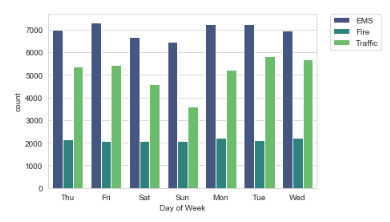

This is a data capstone project in which we do various data manipulation and data visualization based on a datasheet of 911 calls from US.

Here I have used Matplotlib,Seaborn and Plotly libraries for data visualization and Numpy and Pandas for data manipulation .

Here are some pictures,

  
Thanks for visiting
